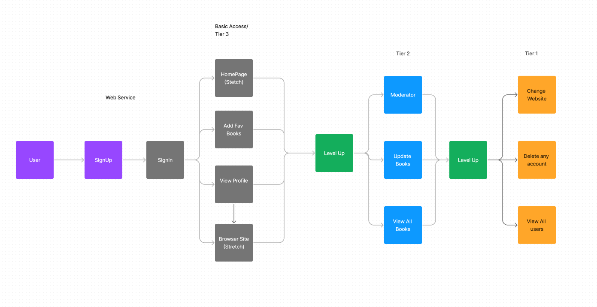

# basic-express-server

LAB - 09
Auth Module Final Project

Author: Jonathan Brooks, Christina Hollie

[Pull Request](https://github.com/CodeFellows-401-Team1/books_model_project/pull/3) -->

[deployed server](https://lab09-7jlr.onrender.com)

Setup
.env requirements:PORT - 3001

Running the app: npm start

Endpoint: Returns Object

<!-- {
  "domain": "deployment-practice-main.onrender.com/",
  "status": "{name: name}",
 "port":
} -->
Tests
Unit Tests: npm run test
<!-- Lint Tests: npm run lint -->

UML:

